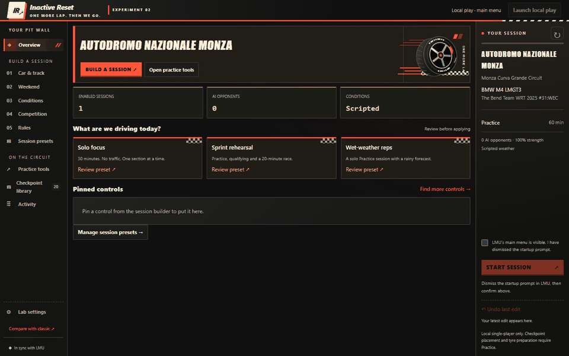

# Inactive Reset

A practice companion for **Le Mans Ultimate**. Save a checkpoint, return to it from the garage, and repeat the corner. Build local sessions and prepare your tyres from one window.

**[Download for Windows x64](https://github.com/Kyraws/inactive-reset/releases/latest)** · [Report a problem](https://github.com/Kyraws/inactive-reset/issues)

*UI walkthrough: session setup, Practice tools and appearance settings.*

## Start here

1. Download and extract the release ZIP. Keep its files together.
2. Open `inactive-reset-ui.exe` with Steam running.
3. Select **Launch local play**, then dismiss LMU’s **Press any button** screen once.
4. Choose your car, track, weekend, weather and opponents. Confirm LMU is at its main menu and select **Start session**.
5. Once loaded, press **Drive** in LMU.

Requires Windows x64 and [Microsoft WebView2](https://developer.microsoft.com/en-us/microsoft-edge/webview2/). No .NET installation needed. The executables are unsigned; Windows may show a SmartScreen prompt.

## Repeat a corner

1. Drive to your starting point and select **Capture** in **Practice tools**.
2. Return to the garage and choose that checkpoint.
3. Select **Place checkpoint**. Wait for **PRESS DRIVE**, then press **Drive** in LMU and follow Activity.
4. Return to the garage whenever you want another attempt.

Checkpoints restore position, not speed, fuel, damage or captured tyre state. They work with other cars on the same track.

## Make it yours

- **Session presets:** save and reuse a weekend’s car, track, weather, grid and rules.
- **Tyres:** set condition and starting heat for all four tyres or each wheel. Heat slider **0 = Game default**. Select **Prepare tyres**, or enable **Apply on placement**.
- **Appearance:** choose Original or the dark-only Redline style; Compact keeps more controls in view. Find these in **Lab settings**.

Checkpoint and tyre tools require **offline, single-player Practice without EasyAntiCheat**. For online racing, close LMU and launch it normally through Steam with EAC. The app refuses to attach to protected sessions.

## Updating or getting help

Back up your `data/` folder before upgrading. Keep `data/` and `offsets/` beside the executables; they contain your saved work and required files. Game updates can require a tool update too.

For a bug report, include the app and LMU versions, car, track, what happened and the relevant **Activity** message.

[Session guide](docs/SESSIONS.md) · [Practice and rules](docs/PLACEMENT.md) · [Tyres](docs/TYRES.md) · [Known limitations](docs/STATUS.md)

For CLI commands, run `inactive-reset.exe --help`. To open the previous interface, run `inactive-reset-ui.exe --classic`.

## Contributing

See [Contributing](CONTRIBUTING.md) for building and tests, and the [documentation index](docs/README.md) for technical details.

[MIT licence](LICENSE) · [Third-party notices](NOTICE). Unofficial; not affiliated with Studio 397, Motorsport Games or the ACO.
